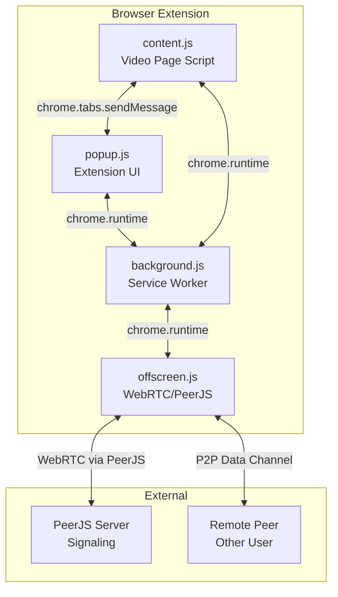
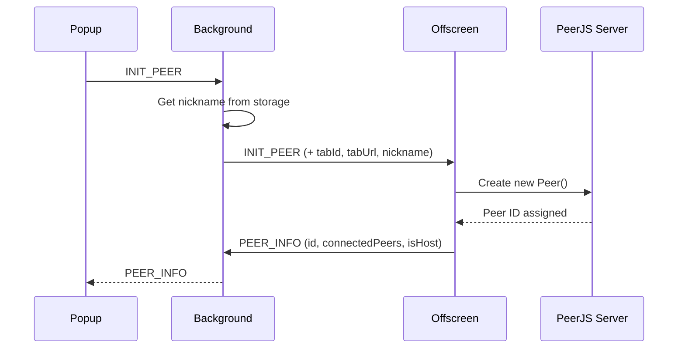
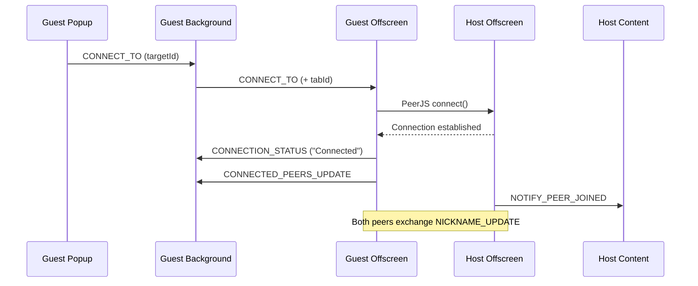
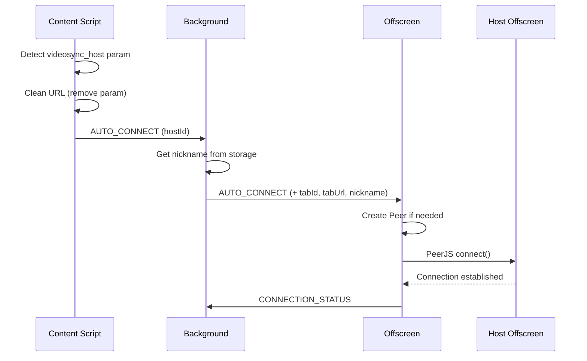
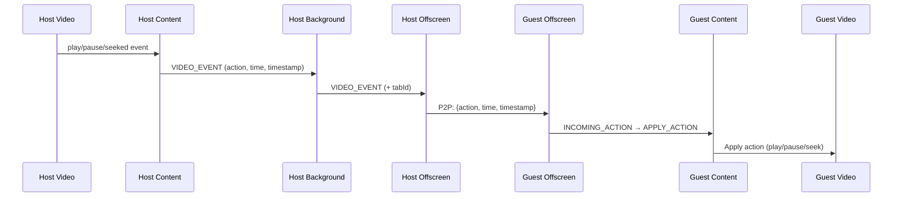
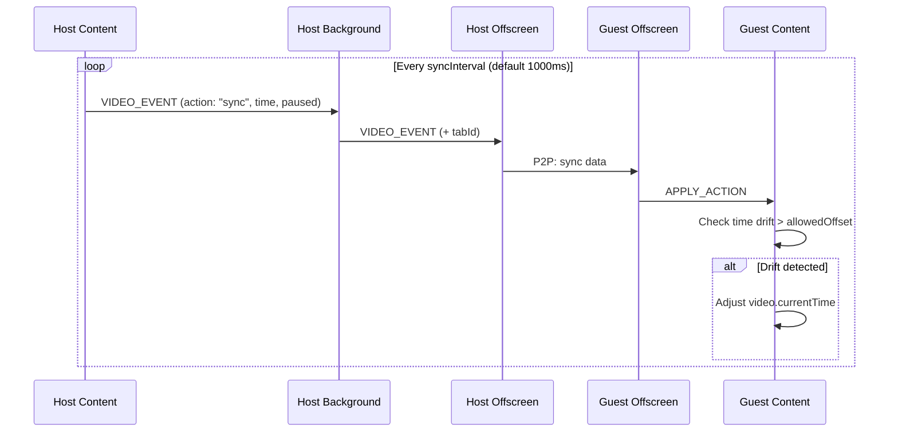
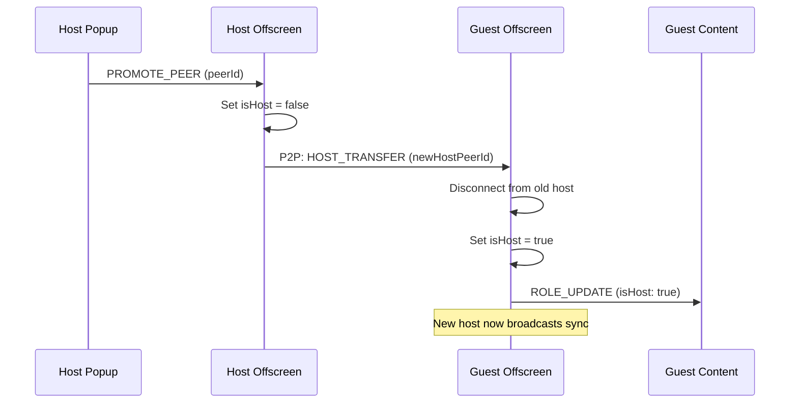
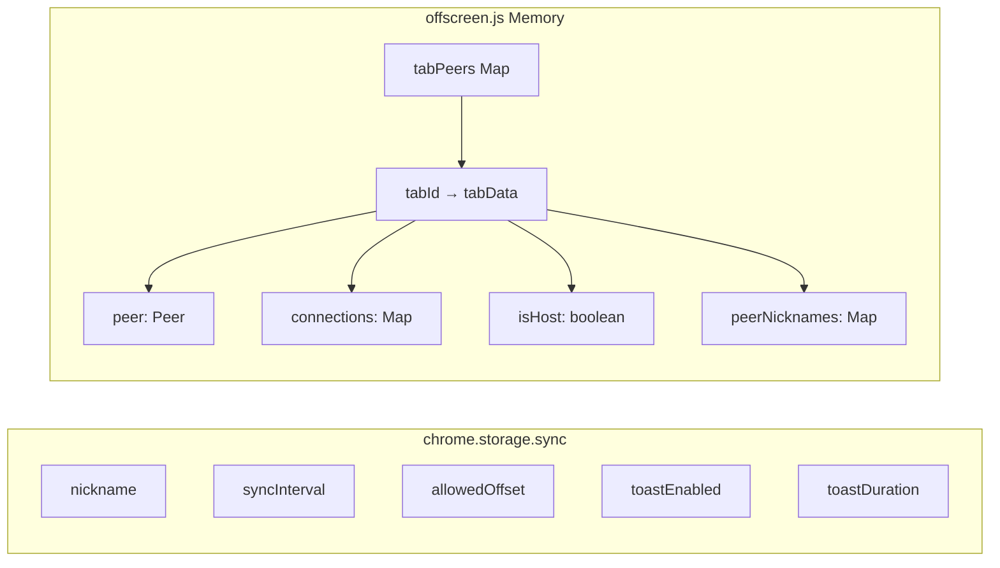
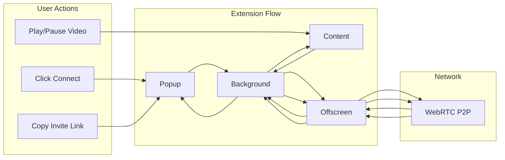

# Video Sync Extension - Data Flow Documentation

This document describes the architecture and data flow of the Video Sync browser extension.

## Architecture Overview

The extension consists of four main components:

### Component Responsibilities

| Component | File | Purpose |
|-----------|------|---------|
| **Popup** | `popup.js` | User interface for connection management |
| **Background** | `background.js` | Message router between components |
| **Content Script** | `content.js` | Video element control and sync |
| **Offscreen Document** | `offscreen.js` | WebRTC peer connections via PeerJS |

## Message Flow Diagrams

### 1. Peer Initialization

When the popup opens, it initializes or retrieves the peer connection:

### 2. Connection Establishment (Manual)

When a guest connects to a host using their ID:

### 3. Invite Link Auto-Connect

When a user opens an invite link with `?videosync_host=<id>`:

### 4. Video Sync Flow (Host → Guests)

How video events are synchronized from host to guests:

### 5. Periodic Sync (Background Sync)

The host periodically sends sync state to keep guests aligned:

### 6. Host Promotion Flow

When a host promotes a guest to become the new host:

## Message Types Reference

### Popup → Background → Offscreen

| Message Type | Description | Key Data |
|--------------|-------------|----------|
| `INIT_PEER` | Initialize peer connection | tabId, tabUrl, nickname |
| `CONNECT_TO` | Connect to a host | targetId |
| `DISCONNECT_PEER` | Disconnect specific peer | peerId |
| `DISCONNECT_ALL` | Leave room / End party | - |
| `REQUEST_HOST` | Request host control | - |
| `PROMOTE_PEER` | Transfer host to peer | peerId |
| `UPDATE_NICKNAME` | Update display name | nickname |

### Content Script → Background → Offscreen

| Message Type | Description | Key Data |
|--------------|-------------|----------|
| `VIDEO_EVENT` | Video state change | action, time, timestamp, paused |
| `VIDEO_CHANGED` | Video URL changed | newUrl |
| `NO_VIDEO_DISCONNECT` | No video on page | - |
| `GET_CONNECTION_STATE` | Query connection status | - |
| `AUTO_CONNECT` | Auto-connect from invite | hostId |

### Offscreen → Background → Popup/Content

| Message Type | Destination | Description |
|--------------|-------------|-------------|
| `PEER_INFO` | Popup | Peer ID and connection info |
| `CONNECTION_STATUS` | Popup | Status message display |
| `CONNECTED_PEERS_UPDATE` | Popup | Updated peer list |
| `ROLE_UPDATE` | Popup + Content | Host/guest role change |
| `INCOMING_ACTION` → `APPLY_ACTION` | Content | Video sync command |
| `NOTIFY_PEER_JOINED` → `PEER_JOINED` | Content | Peer join notification |
| `NOTIFY_VIDEO_NAVIGATE` → `VIDEO_NAVIGATE` | Content | Navigate to new video |

### P2P Messages (via PeerJS Data Channel)

| Message Type | Description |
|--------------|-------------|
| `NICKNAME_UPDATE` | Share nickname with peer |
| `HOST_REQUEST` | Request to become host |
| `HOST_TRANSFER` | Transfer host role |
| `HOST_CHANGED` | Notify of new host |
| `REDIRECT_TO_HOST` | Redirect connection to actual host |
| `VIDEO_NAVIGATE` | Host changed video URL |
| `NO_VIDEO_LEFT` | Host left video page |
| Video sync data | `{action, time, timestamp, paused}` |

## Data Storage

## Component Interaction Summary

